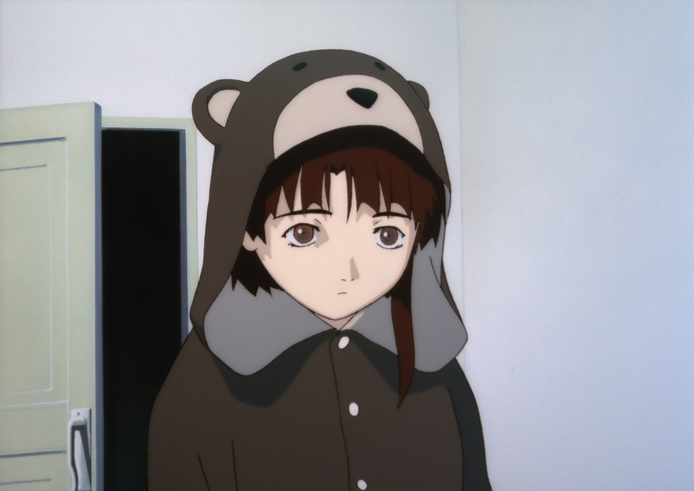

Online I usually go by "(λ () nil)".

I'm from the Czech Republic (or Czechia, whichever you prefer), and I'm a programmer among other things.

Some of my favorite software includes Emacs and Guix, with my favorite languages being Common Lisp, Python and C.

This is my personal blog - a place for all my random thoughts and ideas about anything from software to philosophy and whatever may cross my mind.

Here's a random image of Lain.

